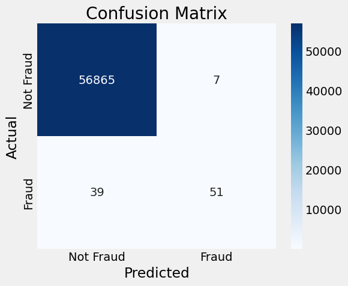

# Model Card

Project forked and inspired by [this repo](https://github.com/karinait/credit_card_fraud_predictor). Dataset is from [Kaggle](https://www.kaggle.com/datasets/mlg-ulb/creditcardfraud). The goal of this project is to use Logistic Regression to predict fraudulent transactions using pyTorch and a custom build model class taught in class.

The reference Archicteture class can be found in [this notebook](https://github.com/ivanovitchm/ppgeec2318/blob/main/lessons/week05/week05c.ipynb).

The dataset will be taken as is, without any preprocessing.

## Model Details

This model is a logistic regression classifier built using PyTorch. The implementation consists of a single linear layer trained with binary cross-entropy loss and optimized using stochastic gradient descent (SGD). It was trained to distinguish fraudulent from legitimate transactions in a highly imbalanced dataset of European credit card activity.

For demonstration and transparency, the model’s architecture is kept simple, with a focus on interpretability and reproducibility. Key parameters such as learning rate, batch size, and number of epochs are defined in the training pipeline configuration:

```python
# Seed number
seed_num = 13

# Sets learning rate
lr = 0.1

model = nn.Sequential()
model.add_module('linear', nn.Linear(x_train_tensor.shape[1], 1))

# Defines a SGD optimizer to update the parameters
optimizer = optim.SGD(model.parameters(), lr=lr)

# Defines a BCE loss function
loss_fn = nn.BCEWithLogitsLoss()

# Train dataset size: 227845
# Train batch size: 64

n_epochs = 100
arch.set_seed(seed_num)
arch.train(n_epochs, seed=seed_num, verbose=True, verbose_mini_batch=False, batch_report=25)
```

## Intended Use
This model is used as a proof of concept for applying logistic regression to credit card fraud detection. It demonstrates how a linear classifier can be integrated into a reproducible ML pipeline and evaluated using meaningful metrics for imbalanced datasets.

Typical stages of the pipeline may include:

- data collection
- preprocess
- train
- evaluate


>⚠️ Note: This model is not intended for production deployment without significant improvements in handling data imbalance, threshold tuning, and validation across diverse transaction environments.

## Training Data

The dataset used in this project is the Credit Card Fraud Detection dataset, containing transactions made by European cardholders in September 2013. It includes 284,807 transactions with 492 labeled as fraud (~0.17%).

Key characteristics:

- Features: 28 anonymized PCA components (V1–V28), plus original Time and Amount fields.
- Target: Binary label (Class): 0 = legitimate, 1 = fraud.
- Data imbalance: Extremely imbalanced in favor of legitimate transactions.
- More caracteristics of this dataset can be found on the ydata-profiling report: [https://angelomarcelino.github.io/credit-card-fraud-ml-project/](https://angelomarcelino.github.io/credit-card-fraud-ml-project/)

## Evaluation Data

The dataset was split into training and test sets. The test set is held out during training and is used solely to evaluate the model's performance.

Data split configuration is handled in the training pipeline configuration:

```python
seed_num = 13

features = df.drop(columns='Class').values
labels = df['Class'].values

X_train, X_val, y_train, y_val = train_test_split(features, labels, test_size=0.2, random_state=seed_num)

# Scaling
scaler = StandardScaler()

scaler.fit(X_train)

X_train = scaler.transform(X_train)
X_val = scaler.transform(X_val)
```

## Metrics
Due to the dataset’s heavy class imbalance, performance is evaluated using several key metrics that emphasize the minority class (fraud).

The Confusion Matrix is used to visualize the model's performance, here is the graph:



The following metrics are calculated on the test set:

| Accuracy | F1    | Precision | Recall |
|----------|-------|-----------|--------|
| 0.9992   | 0.6892 | 0.8793    | 0.5667 |

> Note: The metrics are computed with `Fraud` as the positive class.

While the model demonstrates very high overall accuracy, the relatively low recall on the Fraud class (56.67%) underscores a common challenge in fraud detection: identifying rare but critical positive cases. To improve this, strategies such as adjusting the classification threshold, incorporating class weighting, or applying more advanced ensemble or anomaly detection methods may be warranted depending on the application.

## Ethical Considerations
- Bias: The dataset contains anonymized and transformed features, limiting fairness analysis. Any demographic or socioeconomic bias is currently unmeasurable.

- False Positives: Incorrectly flagging a legitimate transaction as fraud may inconvenience users or cause financial services disruptions.

- False Negatives: Failing to catch fraud could result in significant financial losses. Trade-offs between precision and recall should be addressed with domain-specific thresholds.

- Transparency: Although logistic regression is inherently interpretable, PCA transformation on input features makes individual weights difficult to explain.

- Data Drift: Fraud patterns evolve. This model is trained on 2013 data and may not generalize to current fraud strategies. Regular retraining is essential.

## Caveats and Recommendations
- This model is a baseline and should not be used for deployment without enhancements.

- The extreme class imbalance must be addressed (e.g., using class weighting, resampling, or anomaly detection).

- Performance should not be judged on accuracy alone. Prioritize recall, precision, and AUC-PR for fraud cases.

- Model should be retrained and validated periodically using current data due to evolving fraud behavior.

- This model assumes the test data comes from the same distribution as the training set. Deploying in new domains requires additional validation.

- Future work should explore more powerful models (e.g., tree-based ensembles, neural nets) and advanced sampling or cost-sensitive methods.

